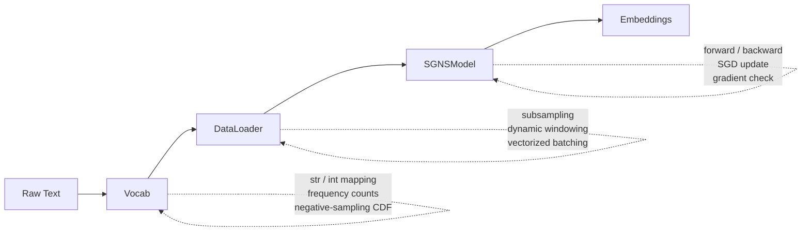
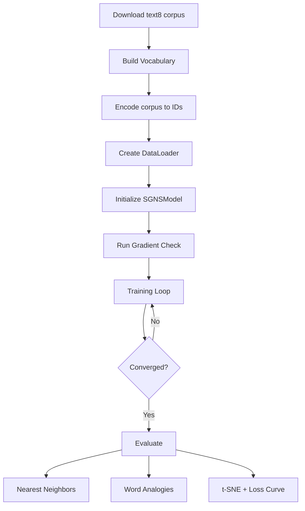

# word2vec-numpy

Pure NumPy implementation of **Skip-Gram with Negative Sampling (SGNS)**, the word2vec algorithm, trained on the [text8](http://mattmahoney.net/dc/textdata.html) corpus (~17 M words).

No ML frameworks. Just NumPy, hand-derived gradients, and a gradient check to prove they're correct.

## Why

To demonstrate low-level ML engineering fluency: understanding the math, implementing the gradients from scratch, proving correctness via numerical verification, and writing clean, type-annotated Python.

## Architecture

Three decoupled components with single responsibilities:



- **`Vocab`**: string/integer mapping, frequency counts, negative sampling CDF
- **`DataLoader`**: subsampling, dynamic windowing, fully vectorized batch generation (no Python for-loops)
- **`SGNSModel`**: forward/backward via `einsum`, scatter-update SGD, numerical gradient check

Each component is independently testable and knows nothing about the others' internals.

## Training Pipeline



## Mathematical Foundation

### Loss Function

For one (center, context) pair with *K* negative samples:

$$L = -\log \sigma(u_o \cdot v_c) - \sum_{k=1}^{K} \log \sigma(-u_k \cdot v_c)$$

where $v_c = W_{in}[c]$, $u_o = W_{out}[o]$, $u_k = W_{out}[\text{neg}_k]$, and $\sigma$ is the sigmoid.

### Gradients

$$\frac{\partial L}{\partial v_c} = -(1 - \sigma(u_o \cdot v_c)) \cdot u_o + \sum_k \sigma(u_k \cdot v_c) \cdot u_k$$

$$\frac{\partial L}{\partial u_o} = -(1 - \sigma(u_o \cdot v_c)) \cdot v_c$$

$$\frac{\partial L}{\partial u_k} = \sigma(u_k \cdot v_c) \cdot v_c$$

The key insight: `grad_scores = sigmoid(scores) - labels`, identical to logistic regression. The backward pass is two lines of `einsum`.

### Gradient Verification

Before training, a centered finite-difference check verifies the analytical gradients:

$$\frac{\partial L}{\partial W_{ij}} \approx \frac{L(W_{ij} + \epsilon) - L(W_{ij} - \epsilon)}{2\epsilon}$$

Relative error must be below $10^{-5}$ for all checked parameters. This runs once at startup (~1 second) and mathematically proves the backward pass is correct.

## Results

### Training Loss

The model converges smoothly with linear learning rate decay over 10 epochs:


### Word Embeddings (t-SNE)

t-SNE visualization of the top 500 most frequent word embeddings, color-coded by semantic category:


### Nearest Neighbors

| Query | Top-5 Neighbors |
|-------|-----------------|
| king | mormaer, eochaid, necho, godwinson, holinshed |
| queen | elizabeth, hrh, gruoch, gloriana, regnant |
| computer | computers, omputer, hardware, programmability, peripherals |
| france | roissy, bourbons, cordiale, vichy, cherbourg |
| river | tributaries, rivers, ziibi, tributary, sutlej |

### Word Analogies

Accuracy on the [Google analogy test set](https://raw.githubusercontent.com/tmikolov/word2vec/master/questions-words.txt) (~19,544 questions):

| Category | Accuracy |
|----------|----------|
| capital-common-countries | 58.7% |
| capital-world | 32.0% |
| city-in-state | 24.2% |
| currency | 9.2% |
| family | 21.0% |
| gram1-adjective-to-adverb | 5.0% |
| gram2-opposite | 4.6% |
| gram6-nationality-adjective | 75.0% |
| **Overall** | **25.4%** |

### Word Similarity

| Dataset | Spearman *rho* | Coverage |
|---------|---------------|----------|
| WordSim-353 | 0.717 | 351 / 353 |
| SimLex-999 | 0.308 | 992 / 999 |

> Results are typical for a pure NumPy implementation trained on text8. Production systems (gensim, fasttext) achieve higher accuracy through optimized C code and larger corpora.

## Usage

### Requirements

- Python 3.10+
- NumPy
- matplotlib (for plots)
- scikit-learn (for t-SNE visualization)

```bash
pip install numpy matplotlib scikit-learn
```

### Training

```bash
python train.py
```

This will:
1. Download the text8 corpus (~100 MB) if not present
2. Build vocabulary (min count = 5)
3. Run gradient check (verifies backward pass correctness)
4. Train for up to 10 epochs with linear LR decay and early stopping (patience = 3)
5. Save checkpoints to `results/`
6. Run evaluation: nearest neighbours, word analogies, t-SNE plot

### Loading Trained Embeddings

```python
from word2vec import Vocab, SGNSModel

vocab = Vocab.load("results/vocab_final.pkl")
model = SGNSModel.load("results/model_final.npz")

# model.W_in is the (V, d) embedding matrix
embeddings = model.W_in
```

## Hyperparameters

| Parameter | Value | Justification |
|-----------|-------|---------------|
| Embedding dim *d* | 300 | Standard for text8-scale corpora |
| Window size | 8 | Wider window for syntactic and semantic context |
| Negative samples *K* | 10 | More negatives improve gradient signal |
| Min count | 5 | Removes hapax legomena |
| Subsample *t* | 1e-5 | Original paper value |
| Learning rate | 0.025 -> 0.0001 | Linear decay (original C impl) |
| Batch size | 1024 | Good vectorization sweet spot |
| Epochs | 10 | With early stopping (patience = 3) |
| Init scale | 0.5/*d* | Keeps initial scores near zero |

## Implementation Notes

### Vectorized Batch Generation

The data pipeline avoids Python for-loops entirely. For each epoch, all valid center positions are expanded into every (center, context) pair within their dynamic window, done in 200 K-token chunks to control memory. Negatives are drawn via `np.searchsorted` on a precomputed CDF.

### `np.add.at` for Scatter Updates

`np.add.at(W, indices, grads)` correctly accumulates gradients when the same word index appears multiple times in a batch. Standard fancy indexing (`W[indices] -= grads`) silently overwrites on duplicates.

This operation is a known NumPy bottleneck: it bypasses internal buffering because it cannot assume unique indices. In a production C++/Numba system, this would use atomic adds or thread-local accumulators. Staying in pure NumPy is the project constraint.

### Numerical Stability

Loss is computed via `np.logaddexp(0, -x)` rather than `log(clip(sigmoid(x)))`. The former is exact for all float64 values; the latter artificially bounds the loss when scores are very negative.

### Learning Rate Scaling

The loss is computed as a mean over all `B * (1 + K)` scores for stable logging, but the learning rate is scaled by `B * (1 + K)` in the update step. This recovers per-pair SGD magnitude, matching the original word2vec C implementation.

## File Structure

```
word2vec-numpy/
├── word2vec/
│   ├── __init__.py        # Package exports
│   ├── vocab.py           # Vocab: tokenization, freq counts, neg sampling table
│   ├── dataloader.py      # DataLoader: subsampling, vectorized windowing, batching
│   └── model.py           # SGNSModel: forward, backward, update, gradientCheck
├── evaluate.py            # Analogies, nearest neighbours, t-SNE, loss curve
├── train.py               # CLI entry point
├── README.md
├── py.typed               # PEP 561 type-checking marker
└── results/
    ├── model_final.npz    # Trained embeddings
    ├── vocab_final.pkl    # Vocabulary
    ├── train_state_epoch{N}.npz  # Checkpoint training state
    ├── tsne.png           # t-SNE visualization
    └── loss_curve.png     # Training loss
```
