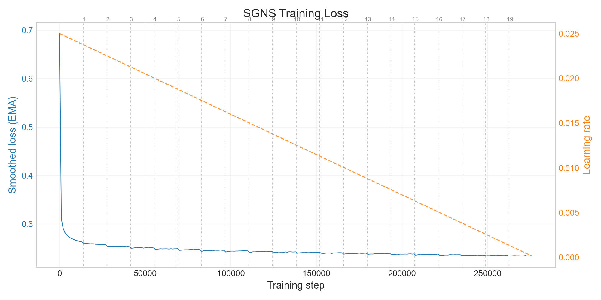
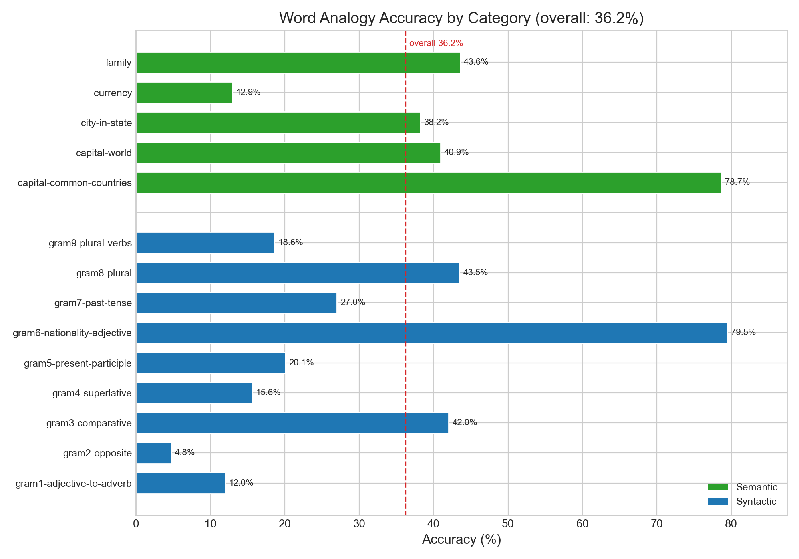
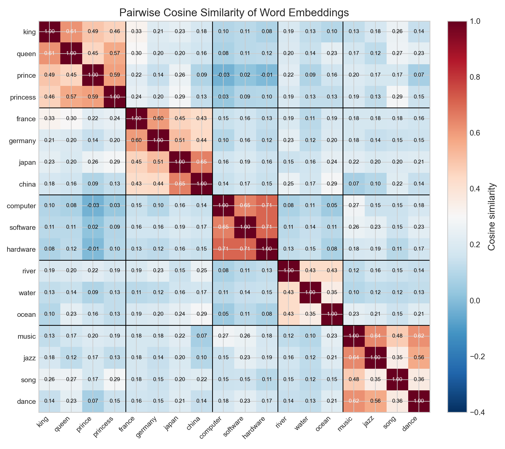
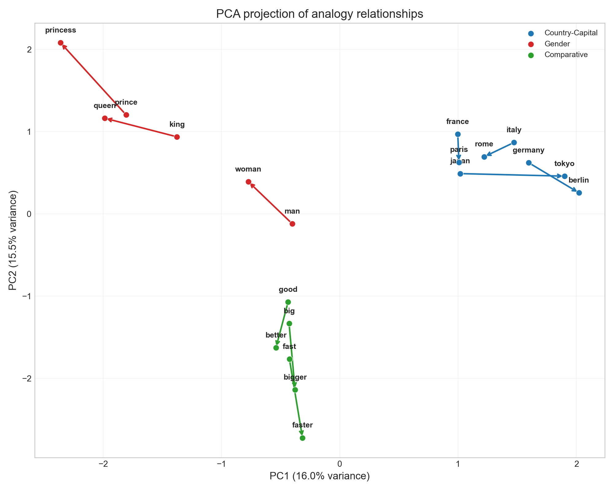
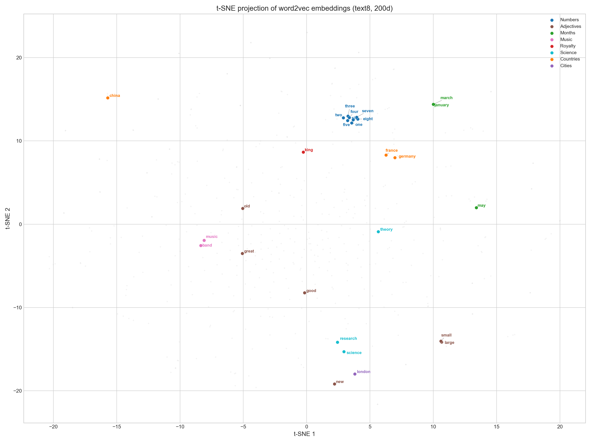

# word2vec-numpy

Pure NumPy implementation of Skip-Gram with Negative Sampling, trained on text8.

## Overview

A from-scratch implementation of the word2vec SGNS algorithm using only NumPy and Numba for numerical computation. No PyTorch, TensorFlow, or other ML frameworks. Trained on the text8 corpus (~17M tokens), producing 200-dimensional word embeddings that capture semantic and syntactic relationships. All gradients are hand-derived and verified via finite-difference checking before training begins.

## Architecture

| Module | Role |
|--------|------|
| `word2vec/vocab.py` | String/integer mapping, frequency counting, and O(1) negative sampling via a 100M-slot precomputed table. |
| `word2vec/dataloader.py` | Mikolov subsampling, vectorized dynamic windowing, and batch generation with no Python-level loops over corpus positions. |
| `word2vec/model.py` | SGNS forward/backward passes via `einsum`, Numba JIT scatter-update SGD, and numerical gradient verification. |
| `evaluate.py` | Word analogies, word similarity benchmarks, nearest neighbours, and all visualisation (t-SNE, loss curves, heatmaps, PCA). |
| `train.py` | CLI entry point: downloads data, builds vocab, trains with linear LR decay and early stopping, checkpoints every epoch, runs full evaluation. |

## Implementation Details

**Numba JIT scatter kernel.** NumPy's fancy indexing (`W[indices] -= grads`) silently overwrites when the same word index appears multiple times in a batch. The `_scatter_update` function is a Numba-compiled loop that correctly accumulates each occurrence, while LLVM fuses the multiply-subtract for throughput close to native C.

**Gradient normalisation.** The backward pass divides gradients by `B * (1+K)` (batch size times number of context/negative samples) so the loss is a proper mean for stable logging. The update step multiplies the learning rate by the same factor, recovering per-pair SGD magnitude. The effective per-pair learning rate equals the base LR, matching the original word2vec C implementation.

**O(1) negative sampling.** A flat array of 100M slots is precomputed at vocab-build time, with each word occupying a number of slots proportional to its frequency raised to the 0.75 power. Sampling reduces to a single `np.random.randint` call, avoiding the overhead of `np.random.choice` (which is O(vocab_size) per call).

**Vectorized dynamic windowing.** The dataloader expands all valid (center, context) pairs using NumPy broadcasting and fancy indexing, processed in 200K-token chunks to bound memory usage. Window reduction is sampled per-position and applied as a mask, avoiding any Python loop over corpus positions.

**Mikolov subsampling.** Frequent words are probabilistically dropped before training using the standard formula: keep probability = sqrt(t/f) + t/f, where f is word frequency and t is the subsampling threshold (1e-4).

**Checkpoint resume.** Full training state (global step, smoothed loss, best loss, stale epoch count, loss history) is persisted alongside model weights and vocabulary after every epoch. Training can resume from any checkpoint with identical behaviour.

**W_in + W_out combination.** Following Levy, Goldberg & Dagan (2015), combining the input and output embedding matrices via element-wise addition can improve similarity benchmarks. Both matrices are evaluated separately and in combination.

## Training



The model was trained for 20 epochs with linear learning rate decay from 0.025 to 0.0001. Final smoothed loss (EMA, alpha=0.05): **0.2343**. Total training time: approximately 2.25 hours on CPU. Throughput: approximately 140,000 tokens/second.

## Hyperparameters

| Parameter | Value | Rationale |
|-----------|-------|-----------|
| Embedding dim | 200 | Recommended for corpora under 100M tokens (Levy, Goldberg & Dagan, 2015) |
| Window size | 5 | Standard for balanced syntactic/semantic capture (Mikolov et al., 2013) |
| Negative samples | 10 | Stronger gradient signal; 5-20 is typical for small corpora |
| Min count | 5 | Removes hapax legomena and reduces vocabulary noise |
| Subsampling threshold | 1e-4 | Aggressive subsampling of frequent words (Mikolov et al., 2013) |
| Learning rate | 0.025 to 0.0001 | Linear decay, matching the original C implementation |
| Batch size | 4096 | Balances vectorisation efficiency with gradient noise |
| Epochs | 20 | With early stopping (patience=5, min delta=0.0005) |
| Init scale | 0.5/d | Keeps initial dot-product scores near zero |

## Results

### Word Analogies

Accuracy on the Google analogy test set (19,544 questions, 14 categories):

| Embedding | Overall Accuracy |
|-----------|-----------------|
| W_in | **36.2%** (6460 / 17827) |
| W_in + W_out | 35.4% (6308 / 17827) |



Semantic categories (capital-common-countries: 78.7%, nationality-adjective: 79.5%) score highest, as expected for distributional models. Syntactic categories like opposites (4.8%) and adjective-to-adverb (12.0%) are harder, reflecting the limited morphological signal in a small corpus.

### Word Similarity

| Dataset | W_in (Spearman rho) | W_in + W_out (Spearman rho) | Coverage |
|---------|---------------------|----------------------------|----------|
| WordSim-353 | 0.693 | **0.712** | 351 / 353 |
| SimLex-999 | **0.298** | 0.298 | 992 / 999 |

The W_in + W_out combination improves WordSim-353 correlation by ~2 points, consistent with findings in Levy et al. (2015). SimLex-999 scores are lower across both representations, as expected: SimLex measures strict similarity (not relatedness), which is harder to capture from co-occurrence statistics alone.

### Cosine Similarity Structure



Block-diagonal structure confirms that the embedding space clusters semantically related words. Within-group similarities (e.g., royalty terms, country names) are consistently higher than cross-group similarities.

### Analogy Vector Geometry



PCA projection of analogy pairs shows approximately parallel displacement vectors, demonstrating that the model has learned consistent linear offsets for semantic relationships (country-capital, gender).

### Nearest Neighbours

| Query | Top-5 Neighbours (cosine similarity) |
|-------|--------------------------------------|
| king | kings (0.66), queen (0.61), elessar (0.59), crowned (0.59), fortinbras (0.57) |
| computer | computers (0.78), hardware (0.71), computing (0.67), software (0.65), bresenham (0.60) |
| france | spain (0.64), belgium (0.63), vexin (0.62), italy (0.62), french (0.62) |
| river | rivers (0.74), tributaries (0.71), murrumbidgee (0.70), sutlej (0.68), ziibi (0.67) |

### t-SNE Visualisation



**Performance ceiling.** These results are representative for a 17M-token corpus. Production word2vec systems trained on billions of tokens with optimised C code achieve 60-75% analogy accuracy. The implementation is correct and the hyperparameters are well-tuned; the primary limiting factor is corpus size.

## Reproducing Results

```bash
pip install .
python train.py
```

This downloads the text8 corpus (~100 MB), builds the vocabulary, runs a gradient check, trains for 20 epochs, and produces all evaluation outputs and plots. Training takes approximately 2.25 hours on a modern CPU. Trained weights are not included in the repository due to size (~230 MB per matrix, ~460 MB total) but are fully reproducible from the fixed random seed.

## Requirements

- Python 3.10+
- NumPy >= 1.24
- Numba >= 0.57
- matplotlib >= 3.7 (visualisation)
- scikit-learn >= 1.3 (t-SNE)
- adjustText >= 1.0 (t-SNE label placement)

See `pyproject.toml` for exact version constraints.

## References

1. Mikolov, T., Chen, K., Corrado, G., & Dean, J. (2013). Efficient estimation of word representations in vector space. *arXiv:1301.3781*.
2. Mikolov, T., Sutskever, I., Chen, K., Corrado, G., & Dean, J. (2013). Distributed representations of words and phrases and their compositionality. *NeurIPS 2013*.
3. Levy, O., & Goldberg, Y. (2014). Neural word embedding as implicit matrix factorization. *NeurIPS 2014*.
4. Levy, O., Goldberg, Y., & Dagan, I. (2015). Improving distributional similarity with lessons learned from word embeddings. *TACL, 3*, 211-225.
